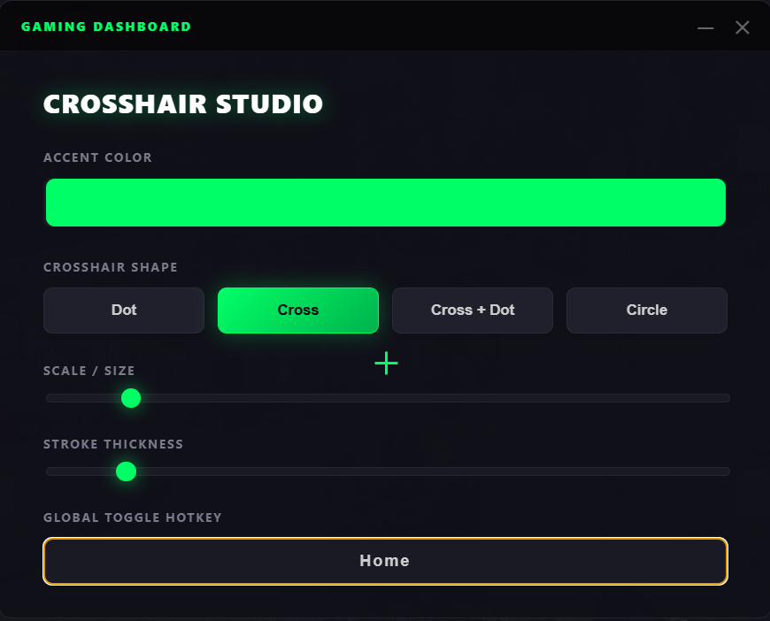
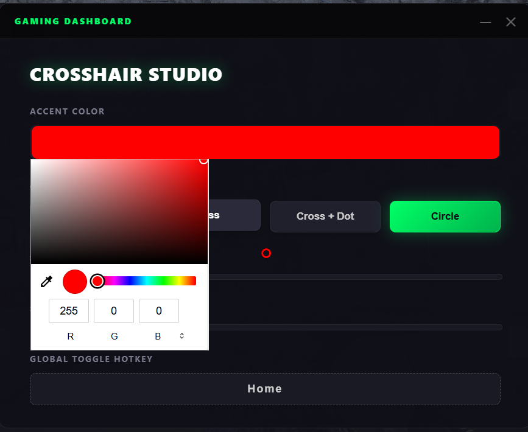
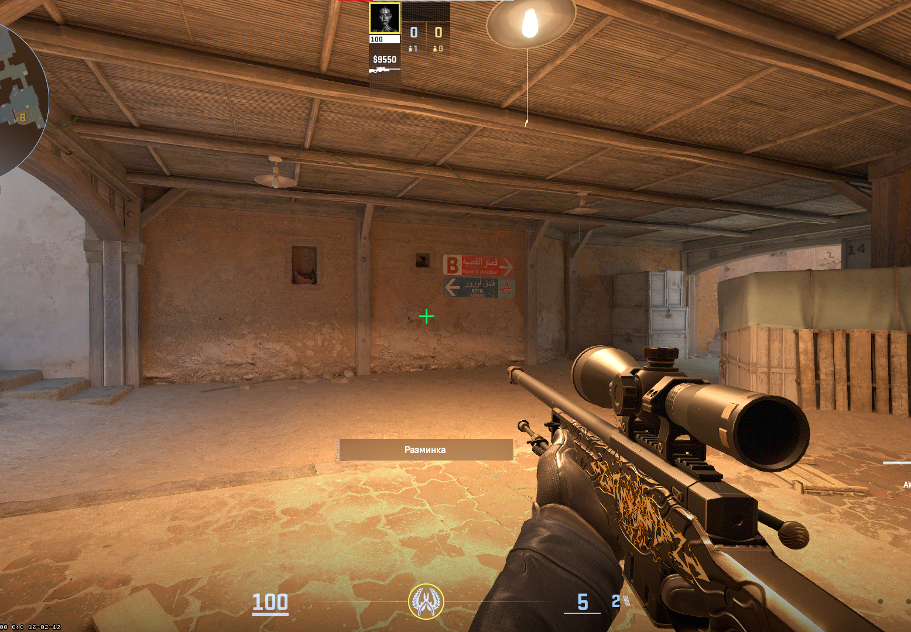
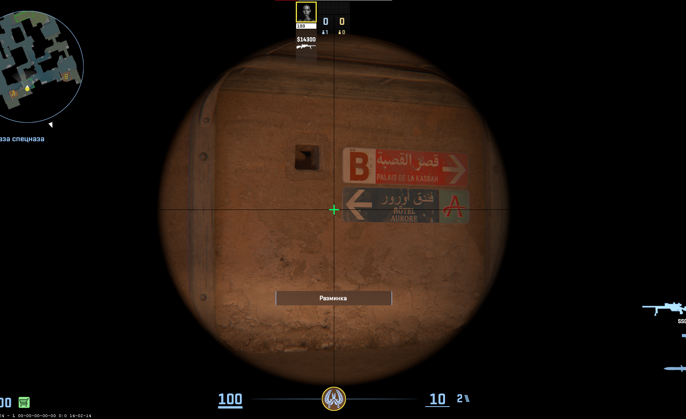

  
  <h1>🎯 ZGameCrosshairZ</h1>
  
<strong>The Ultimate Crosshair Overlay for ALL Games (Windowed / Borderless)</strong>

  
<i>100% Undetectable • Zero-Injection • Ultra-Modern UI</i>

 

---

## 🌍 Languages / Языки
* [English Description](#-english-description)
* [Русское описание](#-русское-описание)

---

## 🇬🇧 English Description

**ZGameCrosshairZ** is a highly advanced, premium-tier crosshair overlay designed for competitive gamers. Unlike traditional overlays that inject into game memory and risk Anti-Cheat bans, ZGameCrosshairZ utilizes a highly optimized `C# Win32` native child process to render mathematical shapes on a truly transparent, click-through layer. 
The software is entirely external and 100% safe to use on **VAC, FaceIT, Vanguard, and EasyAntiCheat** protected games (must run games in Windowed Borderless mode). 

The settings dashboard is built using modern Web Technologies (Electron) to provide a stunning Cyperpunk-inspired glassmorphism User Interface.

### 🎛️ Ultra-Modern Dashboard
The settings panel is your control center. It offers real-time preview and customization. You can freely drag it, adjust settings, and then minimize it to the system tray.

  
  
   <i>Sleek, transparent, and highly responsive UI.</i>

### 🎮 In-Game Experience
The crosshair renders with absolute pixel-perfect precision on your primary monitor. It ignores Windows DPI scaling issues and strictly holds the absolute center.

  
  
   <i>Unobtrusive, precise, and completely click-through overlay.</i>

### 🌟 Key Features
- **Extensive Customization**: Choose from 5 distinct shapes (Dot, Cross, Cross + Dot, Circle, T-Shape). Control exact RGB Color, Stroke Thickness, and Scale.
- **Global Hotkey (Panic Button)**: Assign a custom global bind (e.g., `Insert` or `F4`) to instantly toggle the crosshair visibility deep in-raid without touching the mouse.
- **Zero-Injection Technology**: Pure Win32 layered window rendering `(WS_EX_LAYERED | WS_EX_TRANSPARENT)`. No DirectX hooking! 
- **Lightweight DWM Output**: Forces Windows Context bypassing to ensure the crosshair is never hidden under background apps.

### 🚀 How to Install & Use
1. Navigate to the **Releases** tab on this GitHub repository.
2. Download the standalone executable `ZGameCrosshairZ-1.0.0.exe`.
3. Launch your target game in **Windowed Borderless** or **Windowed**.
4. Run the executable. Set your preferred crosshair configuration in the dashboard.
5. Click the minimize (`—`) button to hide the dashboard into the background. Enjoy your game!

---

## 🇷🇺 Русское описание

**ZGameCrosshairZ** — это профессиональный внешний прицел премиум-класса для геймеров. В отличие от других прицелов, которые внедряются в память игры и вызывают баны встроенных античитов, наша утилита работает как полностью внешний, "прозрачный" и независимый процесс `C# Win32`. 
Он **на 100% безопасен** для использования в играх с защитой **VAC, FaceIT, Vanguard и EasyAntiCheat** (обязательное условие: игра должна работать в режиме "Окно без рамок").

Панель настроек построена на базе веб-технологий (Electron), предоставляя потрясающий пользовательский интерфейс в стиле Киберпанк с эффектами матового стекла (glassmorphism).

### 🎛️ Ультрасовременная Панель Настроек (Dashboard)
Панель — это командный центр вашего прицела. При изменении ползунков прицел мгновенно меняется в реальном времени.

  
  
   <i>Стильный, прозрачный и максимально отзывчивый интерфейс.</i>

### 🎮 Игровой Процесс
Крестик отрисовывается с абсолютной, попиксельной точностью по центру вашего основного монитора. Программа обходит баги масштабирования Windows (DPI Scaling) и намертво держит центр экрана.

  
  
   <i>Минималистичный прицел, который никак не перехватывает клики и выстрелы.</i>

### 🌟 Ключевые возможности
- **Глубокая кастомизация**: На выбор есть 5 уникальных форм (Точка, Крестик, Крест + точка, Круг, Т-образный). Тонкая настройка RGB цвета, размера и толщины линий.
- **Глобальные хоткеи (Бинд)**: Назначьте горячую клавишу (по умолчанию `Insert`), чтобы мгновенно включать и выключать прицел во время напряженной перестрелки, не сворачивая игру.
- **Отсутствие Внедрения (Zero-Injection)**: Окно работает исключительно на базовых системных правах Windows `WS_EX_LAYERED | WS_EX_TRANSPARENT`. Никаких внедрений в DirectX и оперативную память игры!
- **Приватный Win32 Трансмиттер**: Интерфейс полностью отделен от самого прицела — отрисовка выполняется сверхбыстрым, невидимым дочерним C# процессом.

### 🚀 Как установить и пользоваться
1. Перейдите в раздел **Releases** (Релизы) в правой части этой страницы GitHub.
2. Скачайте полностью готовый одиночный файл `ZGameCrosshairZ-1.0.0.exe`.
3. Обязательно переведите вашу игру в режим **"Окно без рамок" (Windowed Borderless)** или **"В окне"**.
4. Запустите файл `ZGameCrosshairZ-1.0.0.exe` и выставите желаемые настройки прицела.
5. Нажмите кнопку свертывания (`—`) в правом верхнем углу интерфейса настройки. Наслаждайтесь игрой!

---

<i>Built with ❤️ by Gamers for Gamers.</i>

